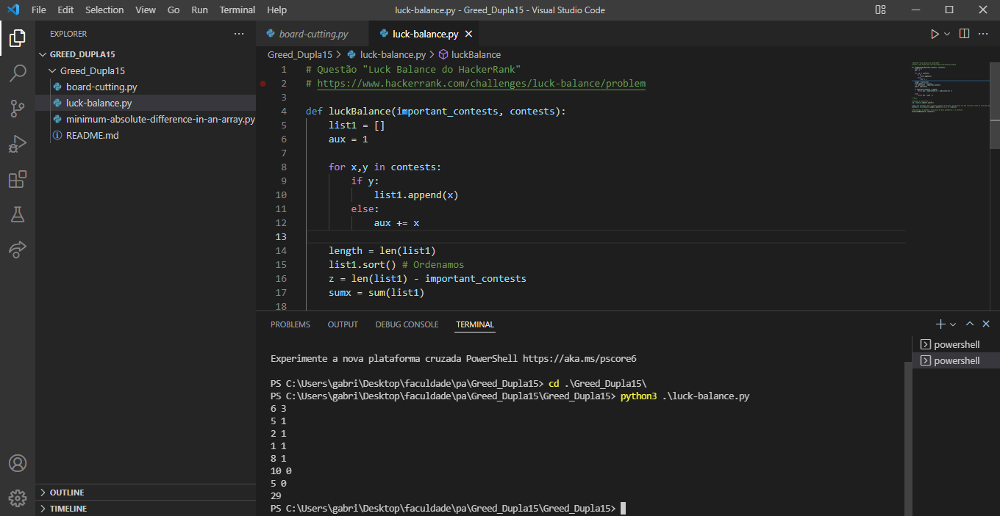
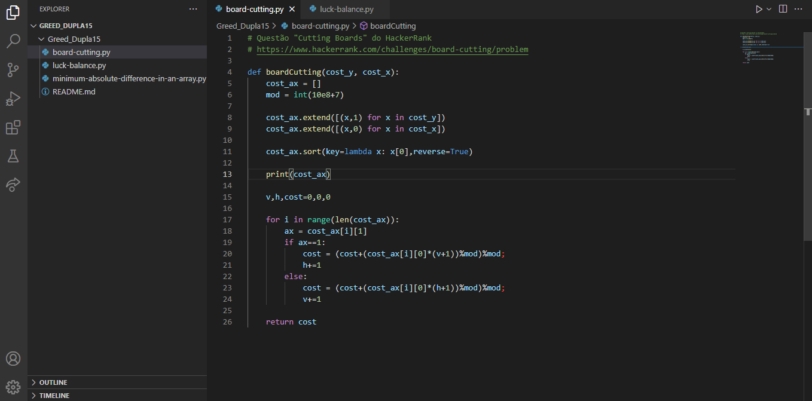
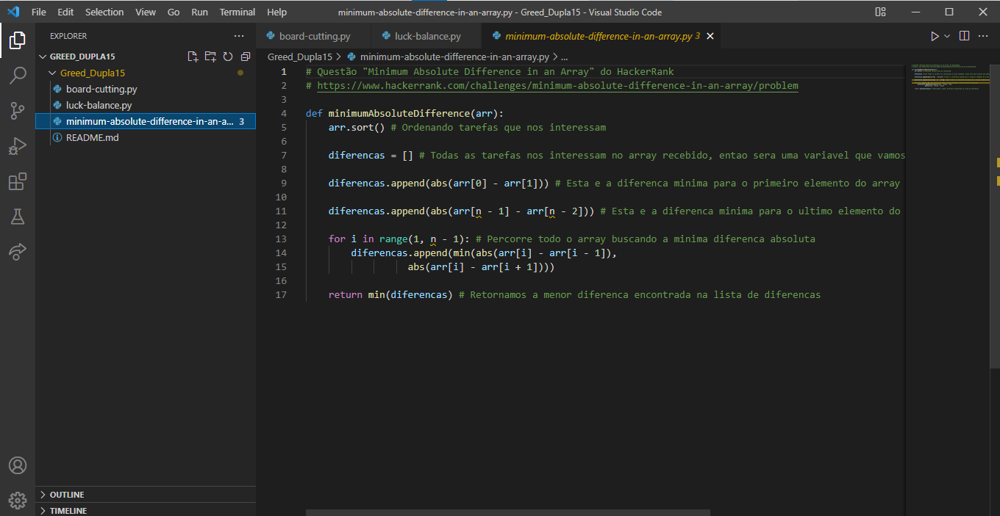

# Dupla15

**Número da Lista**: 3<br>
**Conteúdo da Disciplina**: Greed<br>

## Alunos
|Matrícula | Aluno |
| -- | -- |
| 18/0102656  |  Ítalo Vinícius |
| 18/0145088  |  Gabriel Bonifácio |

## Sobre 
O objetivo desse projeto é utilizar a resolução de 3 exercícios retirados do [HackerRank](https://www.hackerrank.com/) como forma de apresentar exemplos que se utiliza a ideia dos 'Algoritmos Ambiciosos'.

### Apresentação
Logo menos a apresentação estará disponível.

## Screenshots

<div align="center">

  

  [Figura 1: Imagem do programa](./images/img1.png)

</div>
  
<div align="center">

  
  
  [Figura 2: Imagem do programa](./images/img2.png)
  
 </div>
  
<div align="center">

  
  
  [Figura 3: Imagem do programa](./images/img3.png)
  
</div>

## Instalação 
**Linguagem**: Python<br>
**Framework**: (caso exista)<br>

Siga as instruções a seguir para rodar o programa:

1) Fazer a instalação do Python, em uma versão superior a 3.6

2) Clonar o repositório.

```sh 
git clone https://github.com/projeto-de-algoritmos/Grafos2_TransmissaoCOVID.git
```

3) Acessar a pasta da aplicação 

```sh 
cd Greed_Dupla15/
```

4) Analisar as soluções das seguintes pastas: 

```sh 
board-cutting.py
luck-balance.py
minimum-absolute-difference-in-an-array.py
```

5) Você agora poderá testar as soluções na página do [HackerRank](https://www.hackerrank.com/) acessando os links que estão na segunda linha dos arquivos de código.

## Uso 
Após avaliar, você poderá verificar se as saídas estão correspondentes às saídas esperadas.

## Outros 
Extraímos as questão do site do [HackerRank](https://www.hackerrank.com/).


